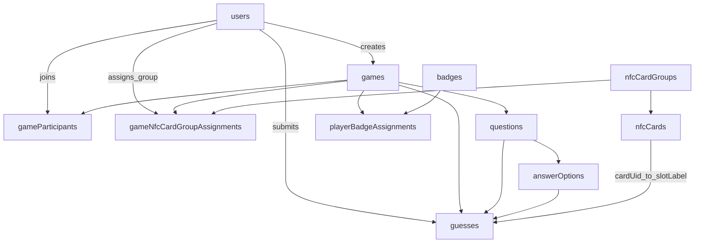
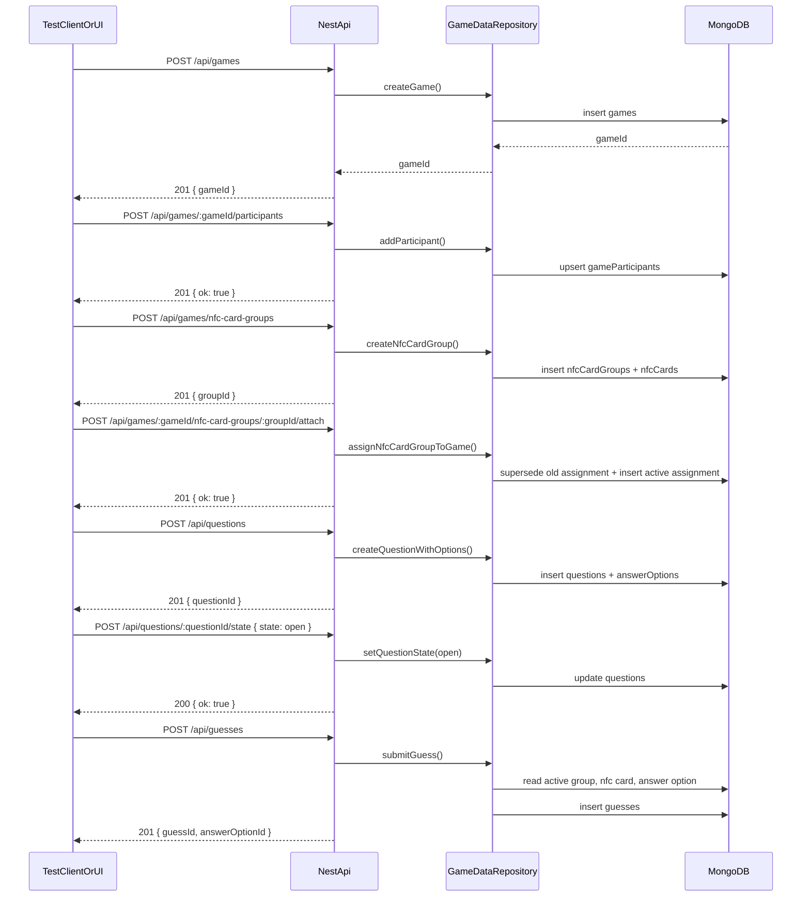

# DB Entity and API Workflow Diagrams

## Entity relationships (Mongo collections)

## Sample API workflow (DB-backed round)

## Endpoint summary

- `POST /api/games`
- `POST /api/games/:gameId/participants`
- `POST /api/games/nfc-card-groups`
- `POST /api/games/:gameId/nfc-card-groups/:groupId/attach`
- `POST /api/questions`
- `POST /api/questions/:questionId/state`
- `POST /api/guesses`
