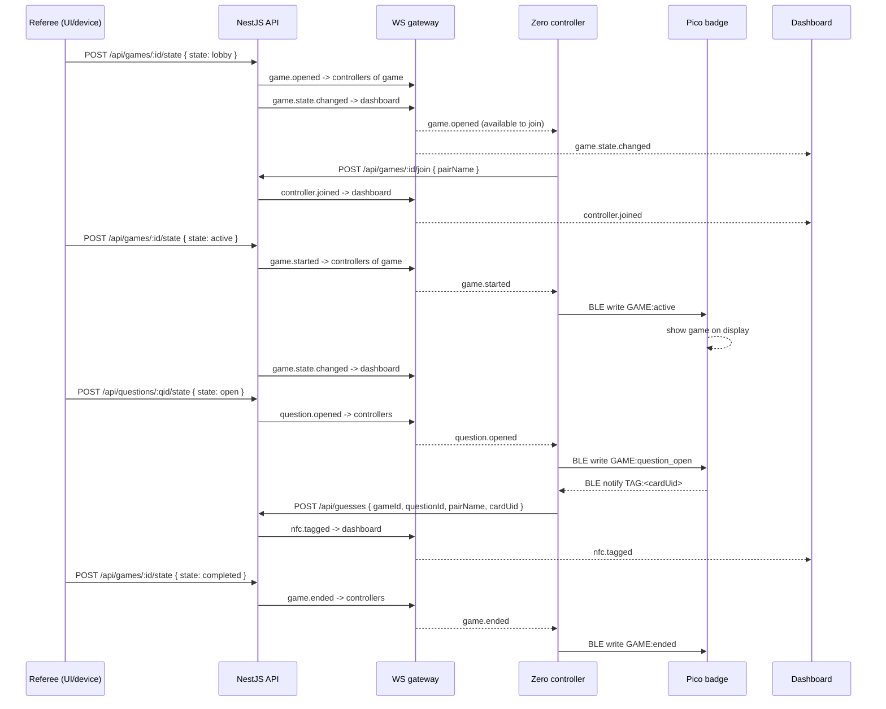
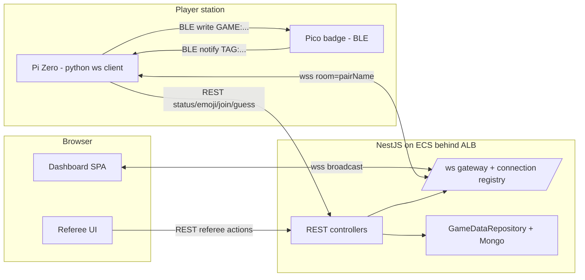
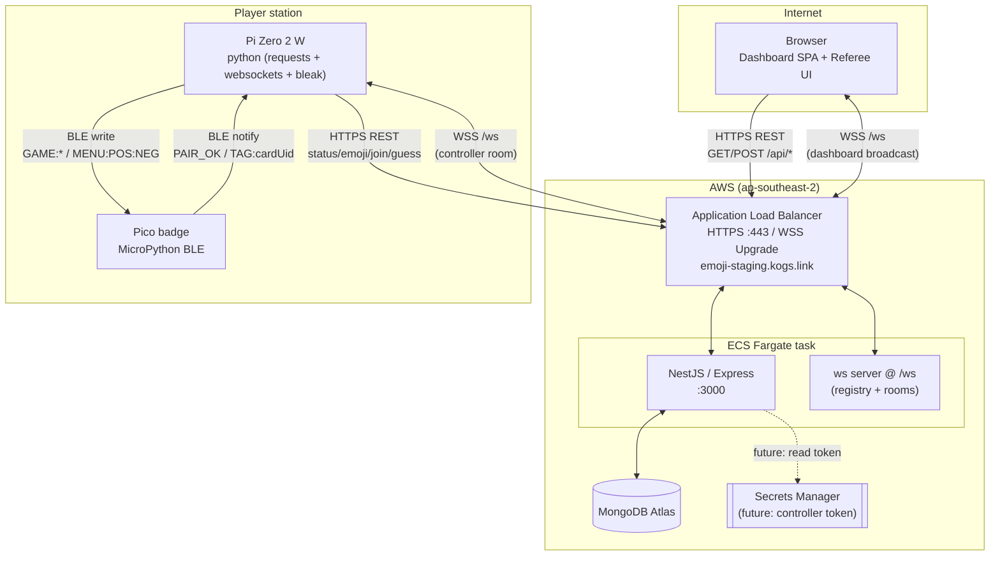
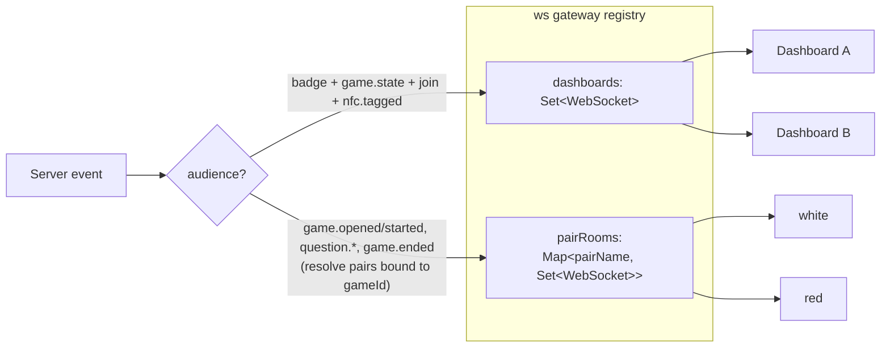
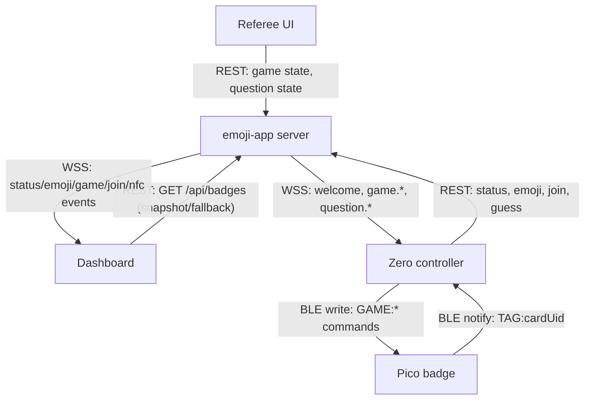
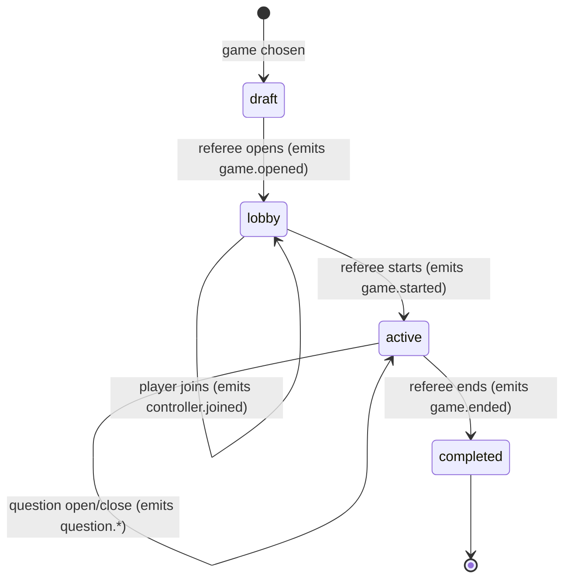

# Game realtime communication design

Status: draft for review. No code yet.

This document designs the communication between the emoji-app server and the
Raspberry Pi Zero controllers (each paired to a Pico badge), so that game state
created in the web app (see
[`db-api-workflow-diagrams.md`](./db-api-workflow-diagrams.md)) can drive the
physical badges, and physical actions (NFC tags) flow back to the web app.

It also pins down the **division of labour between the REST API and the
WebSocket channel**, which is the main question this revision answers.

## Goals

- Run a full **game flow**: referee opens a game for joining, players join,
  referee starts the game, questions open/close, players tag NFC targets, game
  ends.
- Push **game lifecycle events** from the server to the correct Zero controllers
  in near real time.
- Relay **NFC tag events** from the Pico, through the Zero, to the server, and on
  to the dashboard.
- Show **every status change in the React frontend** live.
- Keep the existing **device to server** path (`POST /api/status`,
  `POST /api/emoji`) working.
- Be robust on a constrained, intermittently connected **Pi Zero 2 W**.

## Decisions (locked for this design)

- **Transport: WebSocket** for both the browser dashboard and the Zero. We reuse
  the existing `ws` server at `/ws` (now viable because the app runs on ECS +
  ALB, which supports HTTP `Upgrade`; the old App Runner limitation is gone).
- **Pair identity is `PAIR_NAME`.** Each player station already shares a
  `PAIR_NAME` (e.g. `white`) between its Zero and Pico, loaded from
  `pair_config.py`. We adopt it as the **canonical id of the pair** across the
  system: the binding key, the WS room key, and the human-facing label shown in
  the frontend. `controllerId` (the Pi's logical id) and `badgeId` (BLE-derived)
  remain as secondary/diagnostic fields.
- **Pair binding: `pairName -> gameId` map.** A pair (e.g. `white`) is bound to
  a specific game. Bindings **persist across games** (updated, not cleared, when
  a new game is chosen).
- **Auth: deferred, but wired as a placeholder.** This is a demo; the controller
  handshake carries a `token` field and the ingestion endpoints stay open, but
  the token is **not validated yet**. Including the field now means the wire
  format does not change when real auth lands later (see Reliability and
  security).

## Pair identity (`PAIR_NAME`)

`PAIR_NAME` is a recently added device feature: a short shared label (e.g.
`white`) configured in `pair_config.py` and read by **both** the Zero and the
Pico. The Zero scans for `Pico-Client-<PAIR_NAME>`, and BLE pairing only
succeeds when the Pico receives `PAIR:<PAIR_NAME>` and replies `PAIR_OK`. It is
therefore an identity the two halves of a station have already agreed on.

Why it is the right system-wide identity:

- **Stable** — unlike the MAC-derived `badgeId`, it does not change if the Pico
  reboots or hardware is swapped.
- **Human-readable** — `white` / `red` read well on the dashboard and on the
  device LCDs, far better than `badge-2c-cf-67-c3-76-6b`.
- **Right granularity** — it names exactly one player station (one Zero + one
  Pico), which is the unit that joins a game and tags NFC cards.

How it flows through the system:

- The Zero includes `pairName` in every REST payload (`/api/status`,
  `/api/emoji`, `/api/games/:id/join`, `/api/guesses`) and in `controller.hello`.
- The server uses `pairName` as the **binding key** and **WS room key**, and
  echoes it on every event so the dashboard can label the **Badges** and
  **Game** sections by pair.
- `controllerId` and `badgeId` are still carried for continuity and diagnostics
  (the existing badge view keys on `controllerId::badgeId`).

## Software version reporting

Both device scripts already carry a version constant — the Zero's `VERSION`
(currently `v0.5.3` in `emoji-os-zero.py`) and the Pico's `VERSION` (currently
`0.3.1` in `emoji-os-pico-0.2.4.py`). Neither reaches the server today. We add
two fields so the frontend can confirm each station runs up-to-date software:

- `controllerVersion` — the Zero script version (normalized, e.g. `0.5.3`).
- `picoVersion` — the Pico badge script version (e.g. `0.3.1`).

**How the Zero learns the Pico version.** The Pico reports its version in the
pairing handshake reply: instead of a bare `PAIR_OK`, it sends `PAIR_OK:<version>`
(e.g. `PAIR_OK:0.3.1`). The Zero parses the optional suffix and falls back to
`unknown` for older firmware that still replies a bare `PAIR_OK`, so the change
is backward compatible.

**How it flows.** The Zero includes both versions in `controller.hello` and in
the `POST /api/status` payload. The server stores them on the pair/badge state,
echoes them on `status.changed`, and returns them from `GET /api/badges`.

**Up-to-date check.** The server holds an expected version per role (config
constants for the demo, e.g. `EXPECTED_CONTROLLER_VERSION`,
`EXPECTED_PICO_VERSION`). It exposes those expected values (and/or a computed
`outdated` flag) so the dashboard can badge each station as **current** or
**outdated** next to its `pairName`.

## The core rule: API vs WebSocket

The split follows one principle:

> **Anything a device or referee _initiates_ (a change or a read) goes over the
> REST API. Anything the server _announces_ to many listeners goes over the
> WebSocket.**

In other words the Zero (and the referee UI) **push** via REST and **receive**
via WebSocket. The WebSocket carries server-to-client fan-out only; it is never
used by a device to trigger a state change.

### Use the REST API for (client-initiated request/response)

| Caller | Endpoint | Purpose |
| --- | --- | --- |
| Zero | `POST /api/status` | BLE/liveness status (existing) |
| Zero | `POST /api/emoji` | Emoji selection (existing) |
| Zero | `POST /api/games/:gameId/join` | Player signals they will join |
| Zero | `POST /api/guesses` | Relay an NFC tag as a guess (existing schema) |
| Referee | `POST /api/games/:gameId/state` | Open for joining / start / end game |
| Referee | `POST /api/questions/:questionId/state` | Open / close a question (existing) |
| Admin/UI | `POST /api/games/:gameId/pairs` | Bind a pair (`pairName`) to a game |
| Zero | `GET /api/pairs/:pairName` | Snapshot + WS-down fallback |
| Dashboard | `GET /api/badges` | Snapshot + WS-down fallback (existing) |

Every device-originated payload also carries `pairName` (and keeps `controllerId`
/ `badgeId`), so the server can key the binding/room and the frontend can label
by pair.

### Use the WebSocket for (server-pushed fan-out)

| Direction | Events |
| --- | --- |
| Server to **controllers** (room = `pairName`, filtered by bound game) | `controller.welcome` (snapshot on connect), `game.opened`, `game.started`, `question.opened`, `question.closed`, `game.ended` |
| Server to **dashboard** (broadcast) | existing `status.changed`, `emoji.sent`, plus `game.state.changed`, `controller.joined`, `nfc.tagged` |

All controller and dashboard events include `pairName` so the frontend can group
and label by pair.

The one exception to "WS is receive-only for devices" is the **`controller.hello`
handshake**, which only identifies the socket; it never mutates game state.

## Game flow (end to end)

Roles:

- **Referee** drives the game lifecycle. For now the referee acts through REST
  calls (from a referee UI in the React app, or a referee device); there is no
  referee-specific realtime requirement beyond seeing dashboard updates.
- **Player** is represented by a Zero controller paired to a Pico badge.
- **Dashboard** (React app) observes everything via the WebSocket broadcast.

Assumption for now: a game already exists with **at least one question**.
Loading a saved game or authoring one via the AI chat is handled later.



### Lifecycle state mapping

The existing `game.state` enum already models this; we only need an endpoint to
transition it and to emit on each transition.

| Step | `game.state` | Controller event | What the player sees |
| --- | --- | --- | --- |
| Game chosen (not open) | `draft` | — | nothing |
| Referee opens for joining | `lobby` | `game.opened` | "Game available — join?" on Zero |
| Player joins | `lobby` (unchanged) | — (dashboard gets `controller.joined`) | "Joined, waiting" |
| Referee starts | `active` | `game.started` | indicator on Zero + Pico shows game |
| Question opened | `active` | `question.opened` | question indicator |
| Question closed | `active` | `question.closed` | between-questions state |
| Game ends | `completed` | `game.ended` | game-over screen |

"All players have joined" is a **referee judgement for now** — the referee sees
joins on the dashboard and then starts the game manually. (Auto-start when a
target count is reached can come later.)

## Current state (baseline)

| Concern | Today |
| --- | --- |
| Device to server | `POST /api/status`, `POST /api/emoji` (fire-and-forget REST) |
| Server to browser | `/ws` broadcast (`status.changed`, `emoji.sent`) + `GET /api/badges` poll fallback |
| Server to device | **does not exist** |
| `/ws` addressing | **broadcast to all clients** (no rooms / no identity) |
| Game lifecycle | `game.state` enum exists in Mongo, but **no endpoint transitions it** and nothing is broadcast |
| Join / readiness | **does not exist** as an endpoint |
| Pair to game link | **does not exist** |
| Pair identity | `PAIR_NAME` exists on both devices (`pair_config.py`) but is **not sent to the server yet** |
| Software versions | Zero `VERSION` and Pico `VERSION` exist in the scripts but are **not reported to the server**; the Zero does not know the Pico's version |
| NFC tag relay | Pico has no path back to the Zero/server yet |
| Pico commands | `MENU:POS:NEG` plus legacy `ON/OFF/STATUS/BLINK` |

Relevant code: `server/src/main.ts` (ws bootstrap),
`server/src/badge-state.service.ts` (`emitEvent` broadcast),
`server/src/game-flow.controller.ts` (game writes, `submitGuess`),
`server/src/persistence/models.ts` (`gameSchema.state`, `startedAt`, `endedAt`),
`client/src/app/views/BadgesView.tsx` (browser ws client + poll fallback),
`rainbow-connection/python/emoji-os/emoji-os-zero.py` (Zero, `VERSION`),
`rainbow-connection/python/emoji-os/emoji-os-pico-0.2.4.py` (Pico, `VERSION`).

## Target architecture



## Connection map

These diagrams enumerate every link we plan to build, with its transport and
direction.

### Transport topology (who talks to whom, and how)



### WebSocket routing model (one `/ws`, two audiences)

The gateway keeps a registry so a single endpoint can both broadcast to
dashboards and target a specific pair's room.



### Channels per actor (which link carries what)



### Game lifecycle (state the connections drive)



### Connection roles on `/ws`

The single `/ws` endpoint distinguishes two kinds of clients:

- **Dashboard clients** (browsers): receive the existing `status.changed` /
  `emoji.sent` broadcasts plus the new game/join/tag events, so the frontend
  reflects every status change.
- **Controller clients** (Zeros): identify on connect, join a room keyed by
  `pairName`, and receive only game events for the game their pair is bound to.

Identification happens via a **hello** message right after the socket opens
(mirrors the existing Pico `PAIR:` pattern). The `token` field is a reserved
placeholder: the server **accepts any value (including `null` or absent) for the
demo** and will validate it once auth lands, so the message shape is stable:

```json
{ "type": "controller.hello", "pairName": "white", "controllerId": "zero-1", "controllerVersion": "0.5.3", "picoVersion": "0.3.1", "token": null }
```

The server records `socket -> pairName` and replies with a snapshot:

```json
{
  "type": "controller.welcome",
  "pairName": "white",
  "controllerId": "zero-1",
  "gameId": "<id-or-null>",
  "state": "lobby",
  "joined": false,
  "openQuestionId": "<id-or-null>"
}
```

The `welcome` doubles as a **snapshot** so a freshly (re)connected Zero learns
the current game state immediately, without waiting for the next event.

## Server-side changes

### 1. Pair-to-game binding

New persistence concept linking a pair (`pairName`) to a game. Bindings persist
across games (the row is upserted, never deleted on game end). Minimal shape:

```text
pairBindings
  pairName      string   (unique, e.g. "white")
  gameId        ObjectId (ref Game, nullable)
  controllerId  string   (last-seen Pi id, diagnostic)
  joined        boolean  (reset to false when gameId changes)
  updatedAt     Date
```

Endpoints:

- `POST /api/games/:gameId/pairs` body `{ pairName }` — bind (upsert) a pair to a
  game; resets `joined` to false.
- `GET /api/pairs/:pairName` — current binding + resolved game state (also the
  HTTP fallback for the Zero if WS is down).

### 2. Game lifecycle transitions

`game.state` already exists (`draft | lobby | active | paused | completed |
cancelled`) with `startedAt` / `endedAt`. Add a repository method and endpoint
mirroring the existing `setQuestionState` pattern:

- `POST /api/games/:gameId/state` body `{ state }` — validates allowed
  transitions, stamps `startedAt` when entering `active` and `endedAt` when
  entering `completed` / `cancelled`, then emits the matching controller event
  (`game.opened` for `lobby`, `game.started` for `active`, `game.ended` for
  `completed`) plus a `game.state.changed` to the dashboard.

### 3. Player join

- `POST /api/games/:gameId/join` body `{ pairName }` — marks the pair's binding
  `joined = true` (and/or upserts a `gameParticipants` row). Emits
  `controller.joined` (carrying `pairName`) to the dashboard so the referee can
  see who is ready.

### 4. NFC tag relay

Reuse the existing guess path. The Zero relays a tag forwarded from the Pico:

- `POST /api/guesses` body `{ gameId, questionId, pairName, cardUid }` — existing
  `submitGuess` resolves the active NFC card group, maps `cardUid` to a
  slot/answer option, records the guess, and now also emits `nfc.tagged`
  (carrying `pairName`) to the dashboard. (`badgeId`/`guesserUserId` association
  can be derived from the binding later; for the demo the cardUid + pairName is
  enough to show activity.)

### 5. WebSocket gateway + registry

Refactor the broadcast-only `emitEvent` into a small gateway that supports:

- a **connection registry**: `Map<pairName, Set<WebSocket>>` for pair rooms,
  plus the existing fan-out set for dashboards;
- `broadcastDashboard(event)` — current behavior plus the new game/join/tag
  events;
- `sendToPairsOfGame(gameId, event)` — look up pairs bound to `gameId` and send
  only to their sockets;
- heartbeat ping/pong (see Infra) and cleanup on close.

This can live in `BadgeStateService` initially or move to a dedicated
`RealtimeGateway` to keep responsibilities clear.

### Message protocol

Server to **controller** (room-targeted; `pairName` echoed so the device can
confirm the message is for it):

```json
{ "type": "game.opened", "pairName": "white", "gameId": "...", "title": "Game One", "serverTime": "..." }
{ "type": "game.started", "pairName": "white", "gameId": "...", "serverTime": "..." }
{ "type": "question.opened", "pairName": "white", "gameId": "...", "questionId": "...", "sequence": 1, "serverTime": "..." }
{ "type": "question.closed", "pairName": "white", "gameId": "...", "questionId": "...", "serverTime": "..." }
{ "type": "game.ended", "pairName": "white", "gameId": "...", "serverTime": "..." }
```

Server to **dashboard** (broadcast, in addition to existing badge events):

```json
{ "type": "game.state.changed", "gameId": "...", "state": "active", "serverTime": "..." }
{ "type": "controller.joined", "gameId": "...", "pairName": "white", "controllerId": "zero-1", "serverTime": "..." }
{ "type": "nfc.tagged", "gameId": "...", "questionId": "...", "pairName": "white", "controllerId": "zero-1", "cardUid": "...", "slotLabel": "B", "serverTime": "..." }
```

The existing `status.changed` event (and the `GET /api/badges` snapshot) gain
`controllerVersion` and `picoVersion` so the dashboard can show and verify them:

```json
{ "type": "status.changed", "pairName": "white", "controllerId": "zero-1", "badgeId": "...", "bleStatus": "connected", "controllerVersion": "0.5.3", "picoVersion": "0.3.1", "serverTime": "..." }
```

Server time is canonical (consistent with the badge timestamp policy in
[`domains.md`](./domains.md)).

## Device-side changes

### Zero (`emoji-os-zero.py`)

- Add a **WebSocket client** running in the existing BLE/asyncio thread
  (`websockets` async lib fits the asyncio loop already in use; alternative is
  `websocket-client` on a daemon thread). New dependency on the Pi.
- On connect: send `controller.hello` with the local `PAIR_NAME` (already loaded
  from `pair_config.py`) as `pairName`, plus `controllerVersion` (from its own
  `VERSION`) and `picoVersion` (learned from the handshake); apply the
  `controller.welcome` snapshot.
- Parse the Pico version from the pairing reply (`PAIR_OK:<version>`), defaulting
  to `unknown` when only a bare `PAIR_OK` is received.
- Add `pairName`, `controllerVersion`, and `picoVersion` to the existing
  `POST /api/status` payload (alongside the current `controllerId` / `badgeId`),
  and `pairName` to `POST /api/emoji`.
- On `game.opened`: show a "join?" prompt; on player key press,
  `POST /api/games/:gameId/join` with `pairName`.
- On `game.started` / `question.opened` / `question.closed` / `game.ended`:
  update the LCD and **write a BLE command to the Pico** via the existing
  `write_gatt_char(UART_RX_CHAR_UUID, ...)` path (`GAME:active`,
  `GAME:question_open`, etc.).
- **Subscribe to Pico notifications** (`start_notify` on the UART TX
  characteristic) beyond the one-shot pair handshake, so a `TAG:<cardUid>`
  notification from the Pico triggers `POST /api/guesses`.
- **Reconnect with backoff**; on every (re)connect, apply the snapshot so a
  missed event self-heals. Keep `POST /api/status` heartbeats as-is.
- HTTP fallback: if the socket cannot establish, poll
  `GET /api/pairs/:pairName` on an interval (reuses the heartbeat loop), so the
  feature still works where WS fails.

### Pico (`emoji-os-pico-0.2.4.py`)

- Extend `handle_command` with new namespaced commands, e.g. `GAME:active`,
  `GAME:question_open`, `GAME:question_close`, `GAME:ended`, each mapped to a
  display routine. Additive; the existing `MENU:POS:NEG` parsing and the `PAIR:`
  gate stay intact (commands honored only after `PAIR_OK`).
- On registering an **NFC tag**, send a `TAG:<cardUid>` notification back to the
  Zero over the existing UART TX characteristic (same `gatts_notify` path used
  for `PAIR_OK`).
- Report its version in the pairing reply by sending `PAIR_OK:<VERSION>` (e.g.
  `PAIR_OK:0.3.1`) instead of a bare `PAIR_OK`.

## Infrastructure changes (Terraform)

- **ALB idle timeout**: `modules/alb/main.tf` does not set `idle_timeout`, so it
  defaults to **60s** and will drop idle WS connections. Set
  `idle_timeout = 300` (or higher) on `aws_lb.app`, and rely on application
  **heartbeats** (ws ping/pong every ~30s both ways) to keep connections warm
  and detect dead peers.
- Health check stays on `GET /api/badges` (unaffected).
- No new public endpoints; `wss://emoji-staging.kogs.link/ws` is the same origin.

## Reliability and security

- **Snapshot on connect** (`controller.welcome` + `GET` fallback) means we do
  not need guaranteed delivery of individual events; the latest state always
  wins.
- **Heartbeats** detect half-open sockets on both the ALB and the Pi.
- **Auth: deferred for the demo, placeholder in place.** The `controller.hello`
  message already carries a `token` field and the Zero already sends one (read
  from an env var / `pair_config.py`), but the server does **not** validate it
  yet — any value, including `null` or absent, is accepted. Hardening later is
  then additive and non-breaking:
  - server: validate `token` in `controller.hello` against a secret from Secrets
    Manager; reject the socket on mismatch;
  - ingestion: require the same token (header) on `POST /api/status`,
    `/api/emoji`, `/api/games/:id/join`, `/api/guesses`;
  - Pi: move the token from a plain env var to a managed secret.
  Because the field exists from day one, no wire-format or client change is
  needed when validation is switched on.

## Phased implementation plan

1. **Server foundations (no device impact)**
   - `pairBindings` model (keyed by `pairName`) + bind/get endpoints.
   - Accept `pairName`, `controllerVersion`, and `picoVersion` on `POST /api/status`
     (and `pairName` on `POST /api/emoji`); surface them on `status.changed` and
     `GET /api/badges` so the dashboard can label by pair and verify versions.
   - Add `EXPECTED_CONTROLLER_VERSION` / `EXPECTED_PICO_VERSION` config and expose
     the expected values (or a computed `outdated` flag).
   - `POST /api/games/:gameId/state` (+ repository transition method) and
     `POST /api/games/:gameId/join` (by `pairName`).
   - Extend `submitGuess` to accept `pairName` and emit `nfc.tagged`.
   - Refactor ws into a registry with `broadcastDashboard` +
     `sendToPairsOfGame`; handle `controller.hello` (record `pairName`; accept but
     do not validate `token`); emit controller and dashboard events.
   - Unit tests mirroring existing `*.spec.ts` coverage.

2. **Infra**
   - ALB `idle_timeout`; confirm `wss://` upgrade through the ALB end to end.

3. **Zero**
   - WS client + hello/welcome (send the placeholder `token`) + reconnect/backoff
     + HTTP fallback.
   - Join prompt -> join POST; map game events to LCD updates and Pico BLE
     writes; subscribe to Pico `TAG:` notifications -> guess POST.

4. **Pico**
   - `GAME:*` command handling + display routines; `TAG:` notify on NFC read;
     reply `PAIR_OK:<VERSION>` in the handshake.

5. **Dashboard**
   - Label the Badges and Game sections by `pairName`; show `controllerVersion` /
     `picoVersion` with a current/outdated badge; show binding, join status,
     game/question state, and NFC tag activity; add referee controls to
     open/start/end a game and open/close questions.

## Open questions

- **NFC identity**: `submitGuess` currently needs `questionId` and (per schema)
  a `guesserUserId`. For the demo, do we relax the guess schema to accept a
  `pairName` and derive the user from the binding, or introduce a lighter
  `POST /api/nfc-tags` event that does not write a `guesses` row until identity
  is wired up?
- **"All joined" semantics**: keep it a manual referee decision (current plan),
  or track an expected player count for an auto-ready indicator?
- **Multiple pairs per game**: supported by the room model; confirm the UX
  (several pair rooms in one game) and how the dashboard groups them.
- **`pairName` uniqueness**: pair names (e.g. `white`) must be unique across
  active stations. Is a flat global namespace fine for the demo, or do we
  eventually scope names per game/venue?
- **Pico display semantics**: exact LCD behavior for `game started`,
  `question open`, and `game ended` — needs a quick visual spec.
