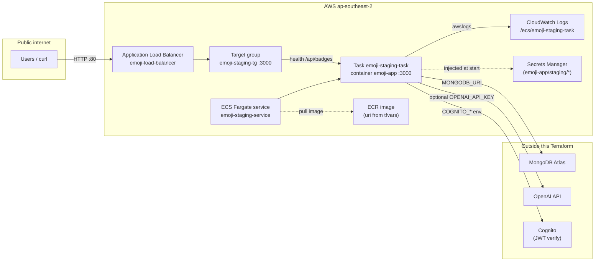
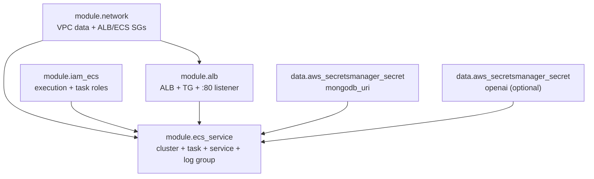
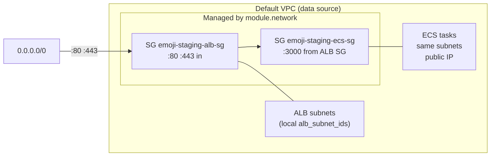
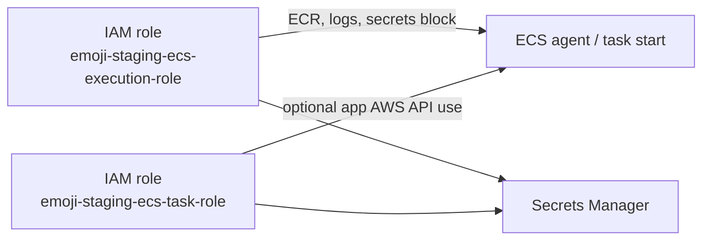
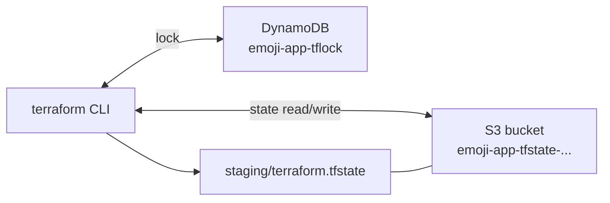

# Terraform ↔ AWS architecture (emoji-app staging)

This document summarizes what the Terraform under `infra/terraform/` provisions and how the pieces connect. It reflects the **staging** environment (`envs/staging/`).

## Table of contents

1. [Scope](#scope)
2. [End-to-end traffic and runtime](#1-end-to-end-traffic-and-runtime)
3. [Terraform module dependency graph](#2-terraform-module-dependency-graph)
4. [Network and security groups](#3-network-and-security-groups)
5. [IAM → ECS](#4-iam--ecs)
6. [Remote state backend (Terraform operations)](#5-remote-state-backend-terraform-operations)
7. [Future / not in diagrams yet](#6-future--not-in-diagrams-yet)

## Scope

- **In Terraform**: default VPC (referenced), security groups, ALB + target group + HTTP listener, IAM roles/policies, ECS cluster/service/task definition, CloudWatch log group.
- **Looked up, not created** (data sources): default VPC/subnets, Secrets Manager secret ARNs for MongoDB and optional OpenAI key.
- **Not managed here**: ECR repository and image pushes (you set `image_uri` in `terraform.tfvars`), secret *values*, MongoDB Atlas, Cognito. The ACM module exists as a **skeleton** (HTTPS/T7) and has no resources yet.

## 1. End-to-end traffic and runtime

Clients hit the public ALB; it forwards to Fargate tasks on port 3000. Tasks read secrets at startup and send logs to CloudWatch.

---

## 2. Terraform module dependency graph

How `envs/staging/main.tf` wires modules (arrows read as “depends on / receives inputs from”).

---

## 3. Network and security groups

The **default VPC** is only referenced (`data.aws_vpc.default`, `data.aws_subnets.default`). Terraform **creates** two security groups and rules: ALB allows 80/443 from the internet; ECS allows **3000/tcp only from the ALB security group**; both allow egress.

ALB and ECS tasks are pinned to an **explicit subnet pair** in `main.tf` (`local.alb_subnet_ids`) so the live ALB matches imported state (two AZs, not all default subnets).

---

## 4. IAM → ECS

- **Execution role**: `AmazonECSTaskExecutionRolePolicy` plus inline policy to `GetSecretValue` / `DescribeSecret` on `emoji-app/staging/mongodb-uri` and `openai-api-key` (wildcard ARN patterns). Used for ECR pull, CloudWatch Logs, and **secret injection** into the container definition.
- **Task role**: same secrets read policy plus a legacy attach (`AmazonEC2ContainerServiceRole`) imported for parity; app runtime may not need the broad managed policy long term.

---

## 5. Remote state backend (Terraform operations)

State lives in S3; locking uses DynamoDB. These resources were **bootstrapped manually** (see `README.md`); Terraform configures the backend in `backend.tf` only.

---

## 6. Future / not in diagrams yet

- **`modules/acm/`**: placeholder for ACM certificate and HTTPS listener (milestone T7); no AWS resources in code yet.
- **HTTPS**: today only **HTTP :80 → target group** (`modules/alb`).

For procedural detail (deploy image, outputs, milestones), see [`README.md`](README.md).
